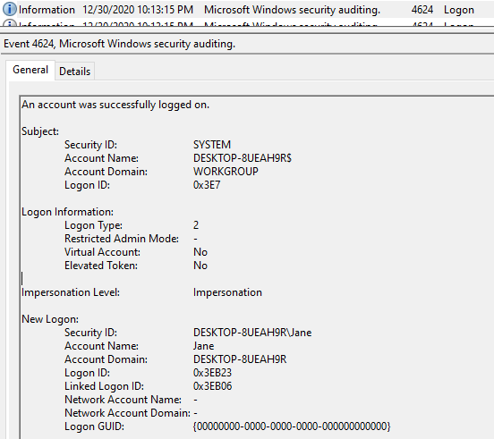
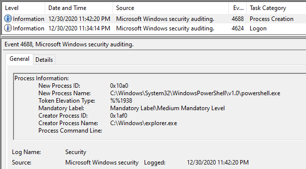
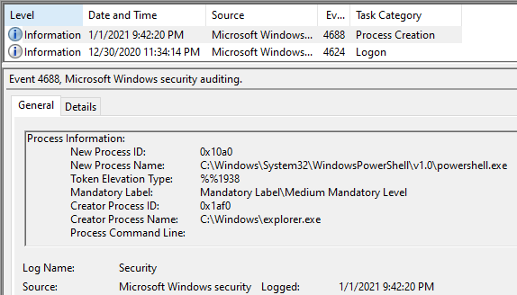

# Use Cases

Please make sure, that all installation requirements (e.g. installed packages in virtual environment) are fulfilled

## 001 Replace username

This use case replaces a given account name with a new value in all records. All event data field named *TargetUserName* and *SubjectUserName* will be modified.
Additionally the *TargetUserSid* and *SubjectUserSid* will be changed.

See [001_replace_username.py](001_replace_username.py)

```shell
$ python3 -m usecases.001_replace_username -h
usage: 001_replace_username.py [-h] src dest old_username new_username new_sid

Replace a given username with new value.

positional arguments:
  src           Path to the source Windows EVTX event log file
  dest          Path to the source Windows EVTX event log file
  old_username  Old username
  new_username  New username
  new_sid       SID of new user

optional arguments:
  -h, --help    show this help message and exit
```

| Original      | Result  |
| ------------- |:-------------:| 
|      |  | 

## 002 Delete logon

This use case deletes all logon records (EventID 4624) for a given account name.

**Note**: Currently all logon records with resident templates will be ignored and not be deleted.

See [002_delete_logon.py](002_delete_logon.py)

```shell
$ python3 -m usecases.002_delete_logon -h
usage: 002_delete_logon.py [-h] src dest username

Replace a given username with new value.

positional arguments:
  src         Path to the source Windows EVTX event log file
  dest        Path to the source Windows EVTX event log file
  username    Account name of user

optional arguments:
  -h, --help  show this help message and exit
```

| Original      | Result  |
| ------------- |:-------------:| 
|      |  |


## 003 Change timestamp

This use case changes the time generated timestamp for a given event record ID.

**Note**: Currently the order of the events is not changed.

See [003_change_timestamp.py](003_change_timestamp.py)

```shell
$ python3 -m usecases.003_change_timestamp -h
usage: 003_change_timestamp.py [-h] src dest eventrecordid new_timestamp

Changes the time generated of a given record

positional arguments:
  src            Path to the source Windows EVTX event log file
  dest           Path to the source Windows EVTX event log file
  eventrecordid  Event record id
  new_timestamp  new timestamp for record in format YYYY-mm-dd HH:MM:SS

optional arguments:
  -h, --help     show this help message and exit

```

| Original      | Result  |
| ------------- |:-------------:| 
|      |  |

